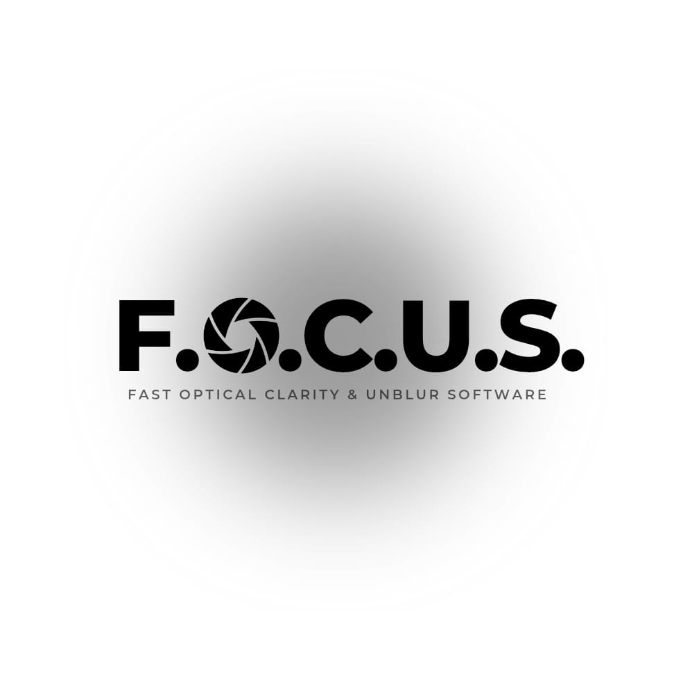
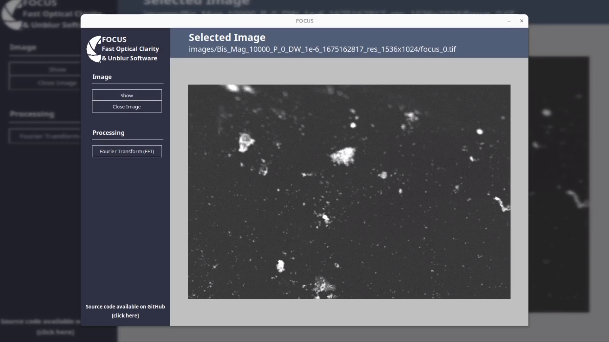
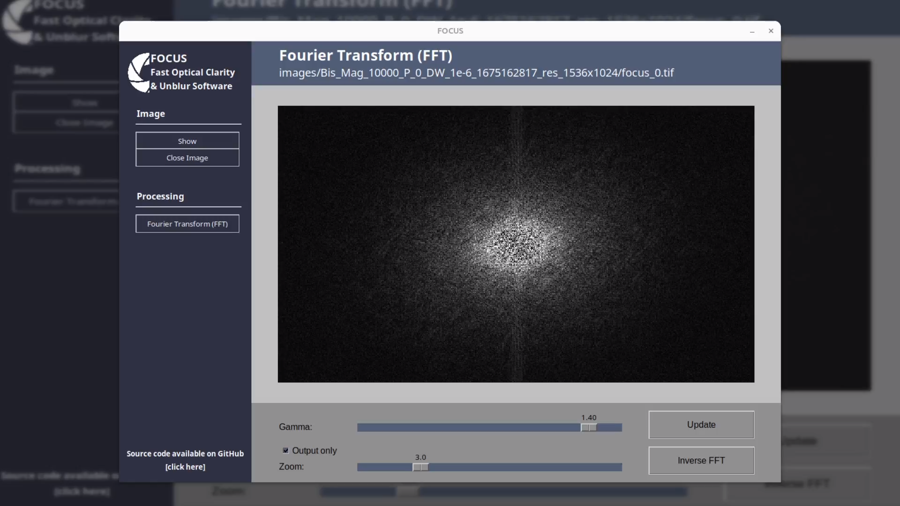

# Blur Scan Project





## Installation
1. Clone the repository:
    ```bash
    git clone https://github.com/clement-marty/blur-scan-project.git
    ```
2. Navigate to the project directory:
    ```bash
    cd blur-scan-project
    ```
3. Setup the python virtual environment and activate it
    ```bash
    python -m venv env
    ```
    - For Linux machines:
        ```bash
        source env/bin/activate
        ```
    - For windows:
        ```bash
        env/Scripts/activate
        ```
4. Install the required dependencies:
    ```bash
    pip install -r requirements.txt
    ```

## Usage
Run the main script to start the application:
```bash
python main.py
```

## Build the application

Follow these steps if you want to recompile a modified version of the application, otherwise use the previously compiled version located in `FOCUS.zip`.

1. Install PyInstaller
    ```bash
    pip install PyInstaller
    ```
2. Run PyInstaller
    ```bash
    pyinstaller main.spec
    ```
3. The files will be located in `dist/main`